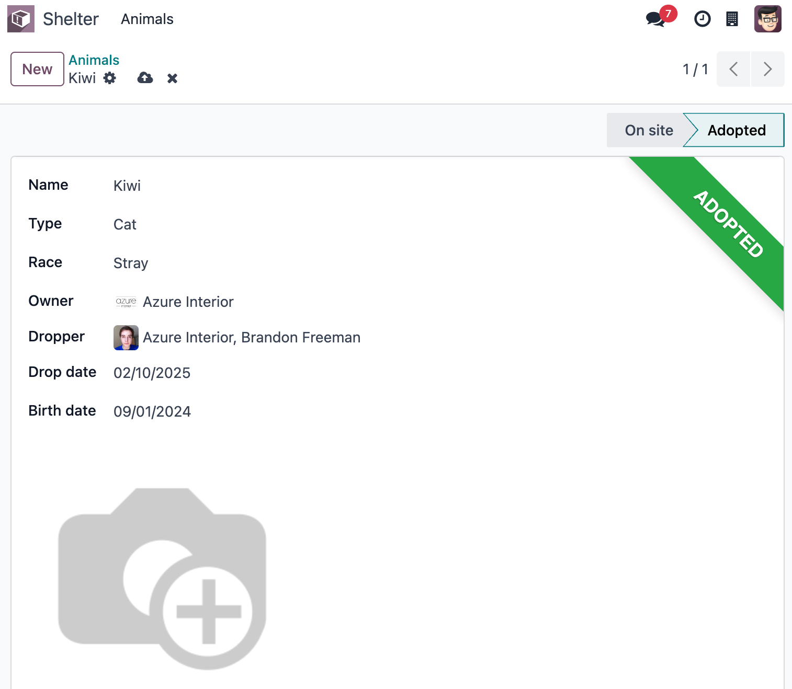
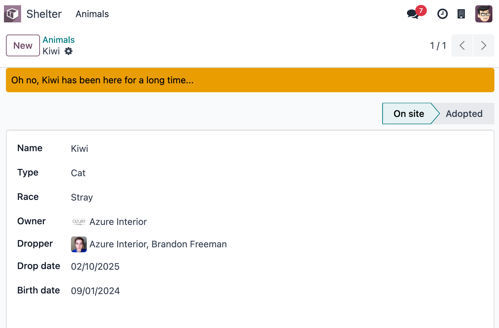
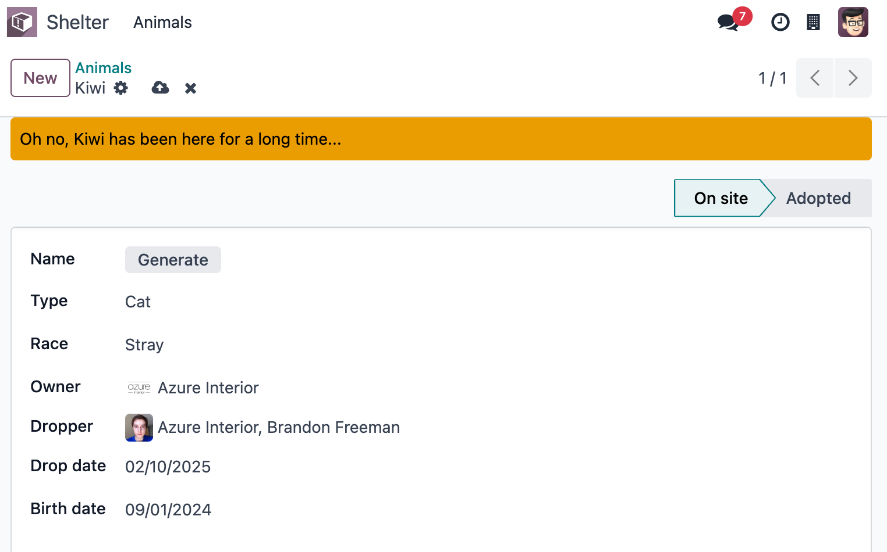
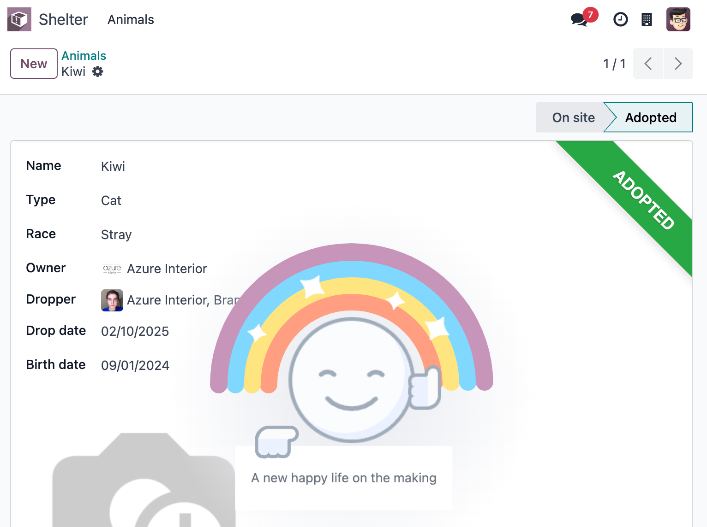
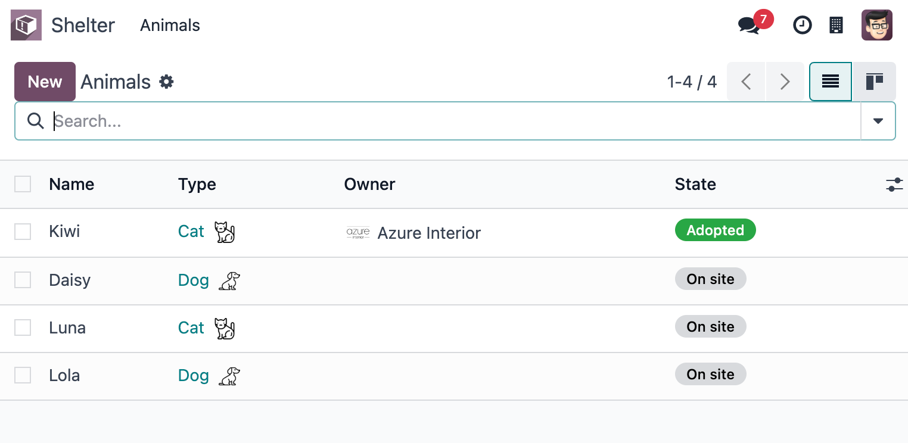

# Module 3: Customize Fields and Views

This project is a sequence of (mostly) independant exercises designed to teach
how to work with fields and views in Odoo.

The setting for this project is an addon that manages a shelter and various kind
of animals that are adopted. All the code is located in the `awesome_shelter`
addon.

To get started, you need a running Odoo server and a development environment
setup. Before getting into the exercises, make sure you have a working setup.
Start your odoo server with this repository in the addons path, then install the
`awesome_shelter` addon.

The `awesome_shelter` addon introduces a few useful models:

- `awesome_shelter.animal` represents a specific animal that has been rescued
- `awesome_shelter.animal_race` is a specific animal race, such as german
  sheperd.
- `awesome_shelter.animal_type` is a small model that help us categorize
  animals, such as "dogs" or "cats"

## Content

- [1. Add a ribbon](#1-add-a-ribbon)
- [2. Display a custom view banner](#2-display-a-custom-view-banner)
- [3. Subclass a char field](#3-subclass-a-char-field)
- [4. Customize a status bar widget](#4-customize-a-status-bar-widget)
- [5. Display pictogram and type in list view](#5-display-pictogram-and-type-in-list-view)
- [6. Extend a view](#6-extend-a-view)

## 1. Add a ribbon

In the kanban and form view for an animal, it would be cool to have a visual
feedback showing that the animal is adopted. Let us do that by adding a ribbon!

This can be done by using an existing widget named `web_ribbon`

1. modify the form view to add a `web_ribbon` widget, which should be visible
   only when the state is `adopted`
2. do the same for the kanban view



## 2. Display a custom view banner

The previous exercise showed how to use a widget. In this exercise, we will
implement a new widget from scratch.

In the form view for the animal model, we want to display a banner with a
message when the animal has been adopted for more than 6 months.

1. create a new component named `LongStayBanner`
2. register it in the `view_widgets` registry
3. Use it in the form view:

   ```xml
       <widget name="long_stay_banner" invisible="state == 'adopted' or not is_present_for_six_month" class="mb-2"/>
   ```



## 3. Subclass a char field

Let us now see how to specialize a field.

1. Subclass the charfield component from `@web/views/fields/char/char_field`
2. register it in the fields registry, and use the field in the form view
3. create a new template to add a button when the name is not set (this can be
   done with `xpaths` or using `t-call`)
4. when the button is clicked, choose a name from a hardcoded list of pet names,
   and set the value of the field




## 4. Customize a status bar widget

Let us now customize the status bar widget to display a more festive effect when
an animal is adopted, which usually happens when the shelter staff clicks on the
`adopted` status.

1. subclass the status bar field
2. register it in the fields registry, and use the field in the form view
3. override the `selectItem` to display a celebratory rainbow man when the
   animal is adopted



## 5. Display pictogram and type in list view

Animals have a type (cat, dog, etc). Those types can have a pictogram. We want
an extension of a one2many field widget to display the name and the pictogram a
little bit like the one2many_avatar, as a single element instead of two columns
in list view.

1. subclass the many2one field
2. use it in the list view
3. modify your field to display a pictogram if it is defined



## 6. Extend a view

Finally, it sometimes happens that we need to work with views instead of fields.

For this exercise, we want to modify the kanban view to reload its data every 10
seconds or so. This is because the shelter staff want to display it on a small
external screen as a visual monitoring tool.

1. Subclass the kanban view
2. register your kanban view in the `views` registry, and use it (with
   `js_class` attribute) in the animal kanban view
3. Modify the code to reload every 10s
